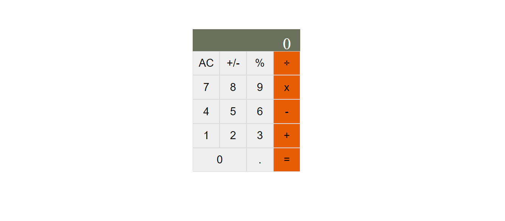

## Math Magicians

> "Math magicians" is a website for all fans of mathematics. It is a Single Page App (SPA) that allows users to make simple calculations and read a random math-related quote.

## Screenshot

## Live Demo

Not available for this branch

## Built With

- React

## Getting Started

To get a local copy up and running follow these simple example steps.

- Clone the repository by running git clone `https://github.com/Micky373/math_magicians.git`
- Navigate to the folder `cd math-magicians`
- Install packages by running `npm install`
- Run the app by running `npm start`

## Author

👤 **Michael Tamirie**

- `GitHub`: [Michael Tamirie](https://github.com/Micky373)
- `LinkedIn`: [Michael Tamirie](https://www.linkedin.com/in/michael-tamirie-288a331ab)

## Show your support

Give a ⭐ if you like this project!
